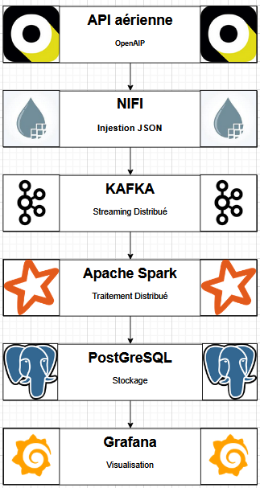
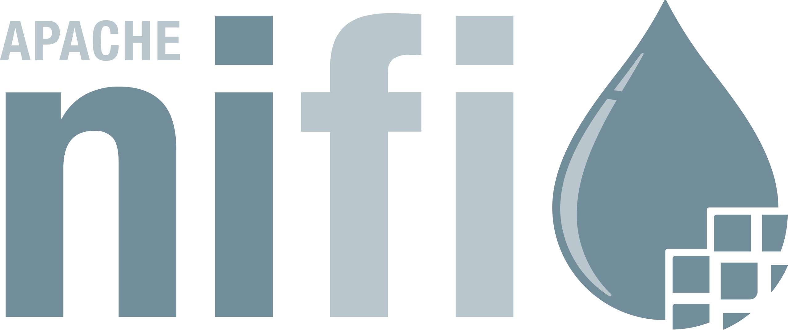
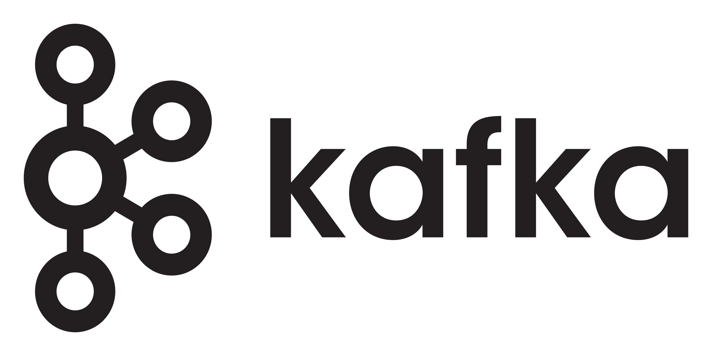
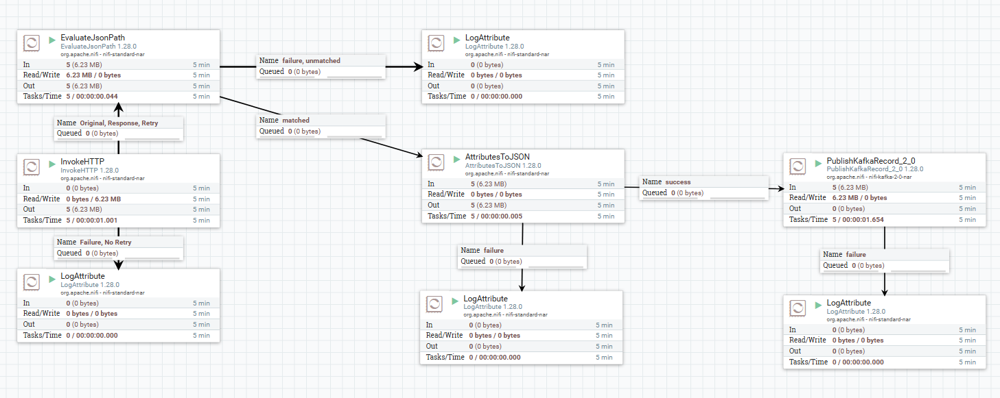
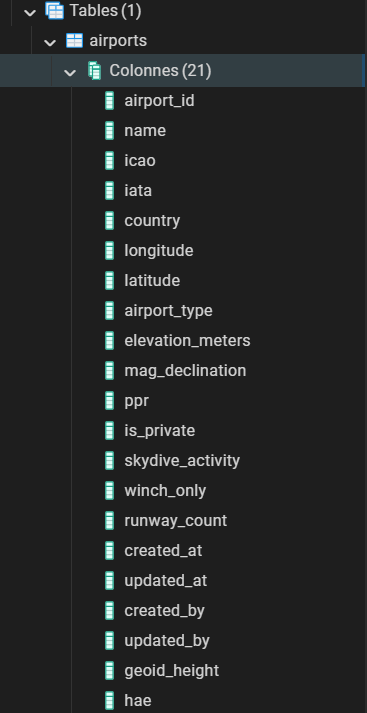
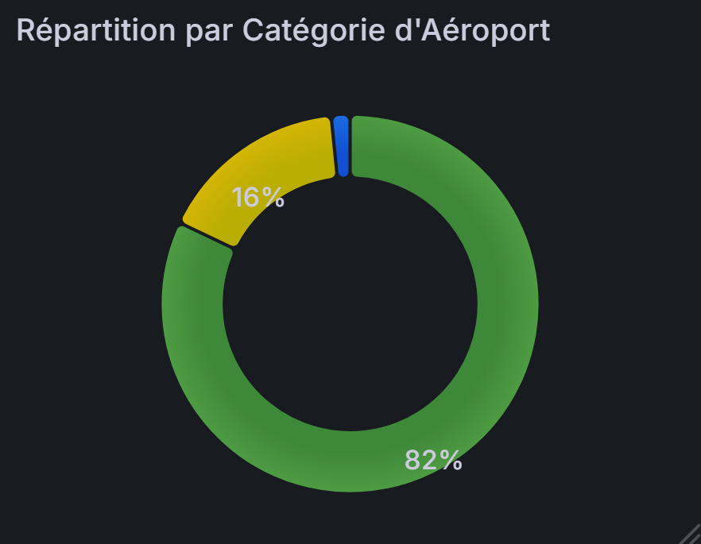
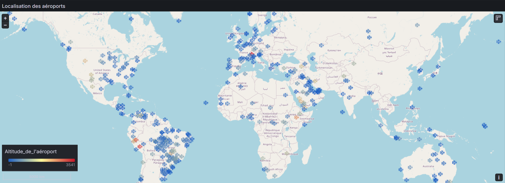

# Projet Données Distribuées — Pipeline Big Data

## 🧠 Objectif du projet

Ce projet a pour but de **mettre en place un pipeline de traitement distribué de données aéronautiques** en temps réel, en s'appuyant sur un écosystème Big Data complet :  
**NiFi → Kafka → Spark → PostgreSQL → Grafana**.

L’objectif est de :
- Collecter des données d’aéroports ou de vols via une API open source (comme AviationStack ou OpenAIP).
- Ingest ces données dans Kafka à l’aide d’un flux NiFi.
- Traiter et nettoyer les flux en temps réel avec **Apache Spark Structured Streaming**.
- Stocker les résultats dans une base de données **PostgreSQL** accessible via **pgAdmin**.
- Restituer les données récoltées via **Grafana**.

---

## ⚙️ Architecture technique

<p align="center">
  
</p>


## 🧩 Technologies utilisées

|Logo| Composant | Technologie | Rôle |
|----|-----------|-------------|------|
|| **NiFi** | apache nifi:1.28.0 | Collecte et routage des données depuis l’API |
|| **Kafka** | Apache Kafka 3.5 | File de messages pour la diffusion temps réel |
|| **Spark** | apache spark:3.5.0 | Traitement et transformation des données |
|| **PostgreSQL** | PostgreSQL 15 | Stockage persistant et structuré |
|| **pgAdmin** | Interface web | Consultation et gestion de la base de données |
|| **Docker Compose** | Orchestration | Démarrage automatisé de tous les services |
|| **Grafana** | grafana-enterprise:latest | Restitution graphique |

---

## 🐳 Démarrage du projet

### Docker Compose :

Aperçu du fichier `docker-compose.py` :

```python
# docker-compose.py - aperçu
version = "3.9"

services = {
    "nifi": {
        "image": "apache/nifi:1.28.0",
        "ports": ["8443:8443"],
        ...
    },
    "kafka": {
        "image": "confluentinc/cp-kafka:7.5.0",
        ...
    },
    # (code tronqué)
}

```
[Voir le fichier complet](docker-compose.py)


### 2️⃣ Accès aux interfaces :

| Service      | URL                        |
|-------------|----------------------------|
| NIFI        | [https://localhost:8443/nifi](https://localhost:8443/nifi) |
| PgAdmin     | [http://localhost:5050](http://localhost:5050) |
| Spark Master| [http://localhost:8080](http://localhost:8080) |
| Grafana     | [http://localhost:3000](http://localhost:3000) |

###  1️⃣ Récupération des données avec Apache NiFi :
- **Rôle :** Collecte et routage des données depuis les API aéronautiques.  
- Connecteurs vers différentes APIs.  
- Prétraitement léger (filtrage, enrichissement).  
- Envoi vers Kafka pour diffusion en temps réel.  



- InvokeHTTP : **Connexion à l’API** externe pour récupérer les données aéronautiques.
- EvaluateJsonPath : **Analyse le JSON** reçu pour extraire les champs spécifiques
- AttributesToJSON : **Convertit les attributs** NiFi extraits en nouveau flux JSON structuré
- PublishKafkaRecord : Envoie les données transformées **vers un topic Kafka**
- LogAttribute : **Composant de debug** et de suivi

###  2️⃣ Apache Kafka
- **Rôle :** File de messages pour diffuser les données en temps réel.  
- Producteurs : NiFi envoie les données.  
- Topics : organisent les flux par type de données.  
- Consommateurs : Spark récupère les données pour traitement. 

###  3️⃣ Apache Spark (Structured Streaming)
- **Rôle :** Traitement et nettoyage des flux en temps réel.  
- Calculs sur flux en continu.  
- Nettoyage, transformation et agrégation des données. 

Afin de réaliser les traitements, un fichier PySpark a été crée : **Streaming-processor**
Ce script gère le traitement en temps réel des données d’aéroports provenant de Kafka, avant de les insérer dans PostgreSQL.

**Voici les grandes étapes du pipeline Spark :**

| 🧩 Étape | ⚙️ Fonction | 🧠 Description |
|:--:|:--|:--|
| 1️⃣ | **Configuration** | Charge les dépendances **Kafka** et **PostgreSQL** |
| 2️⃣ | **Schémas** | Décrit la structure des **données d’aéroports** |
| 3️⃣ | **SparkSession** | Initialise **Spark** avec les bons connecteurs |
| 4️⃣ | **Lecture** | Récupère les **données JSON** depuis **Kafka** |
| 5️⃣ | **Transformation** | Nettoie et **normalise les champs importants** |
| 6️⃣ | **Debug** | Affiche les **données dans la console** |
| 7️⃣ | **Écriture** | Insère les **aéroports dans PostgreSQL** |
| 8️⃣ | **Exécution** | Laisse le **streaming tourner en continu** |

Aperçu du fichier `Streaming-processor.py` :

```python
# Streaming-processor.py - aperçu
from pyspark.sql import SparkSession
from pyspark.sql.functions import from_json, col, explode
from pyspark.sql.types import StructType, StructField, StringType

spark = SparkSession.builder.appName("AirportDataProcessing").getOrCreate()

# Lecture du flux Kafka
kafka_df = spark.readStream.format("kafka")\
    .option("kafka.bootstrap.servers", "kafka:9093")\
    .option("subscribe", "airports")\
    .load()

# (code tronqué)
```
[Voir le fichier complet](Streaming-processor.py)

###  4️⃣ PostgreSQL + pgAdmin
- **Rôle :** Stockage persistant et gestion de la base de données.  
- pgAdmin pour explorer les tables et exécuter des requêtes.

Il y a dans l'API une vingtaine de colonnes. Toutes ont été récoltées et stockées dans PostgreSQL

<p align="center">
  
</p>

**Voici ci-dessous un échantillon de nos données**
[](image/TableauPgAdmin.png)


###  5️⃣ Grafana
- **Rôle :** Visualisation graphique des données en temps réel.  
- **Fonctionnalités principales :**  
  - Création de **dashboards** pour représenter les données d’aéroports.  
  - Graphiques, alertes et indicateurs clés (**KPI**).

**Voici par exemple deux graphiques :**

<p align="center">
  
  
</p>

<p align="center">
  
</p>


## 🏁 Conclusion

Ce projet, réalisé dans le cadre du cours **Données Distribuées**, illustre la mise en place d’un **pipeline de données distribuées** complet pour le traitement en temps réel de données aéronautiques.  

Grâce à l’intégration de **NiFi, Kafka, Spark, PostgreSQL et Grafana**, nous avons pu :  

- Collecter et centraliser des données depuis une API aéronautique.  
- Traiter et nettoyer ces flux en temps réel avec Spark Structured Streaming.  
- Stocker les résultats de manière structurée et persistante dans PostgreSQL.  
- Visualiser les informations et indicateurs clés via des dashboards Grafana.  

Le projet démontre également l’importance de **Docker Compose** pour orchestrer facilement l’ensemble des services et faciliter le déploiement.  